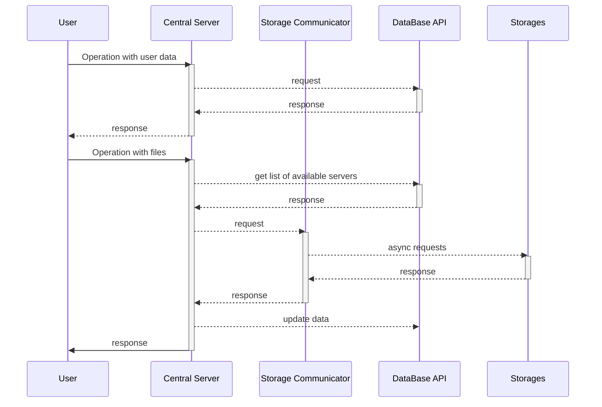
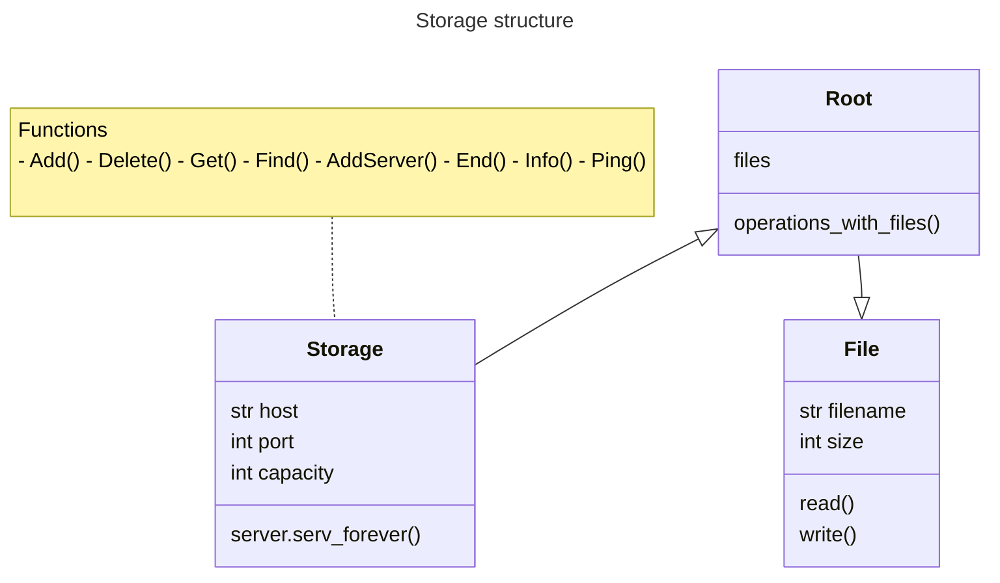
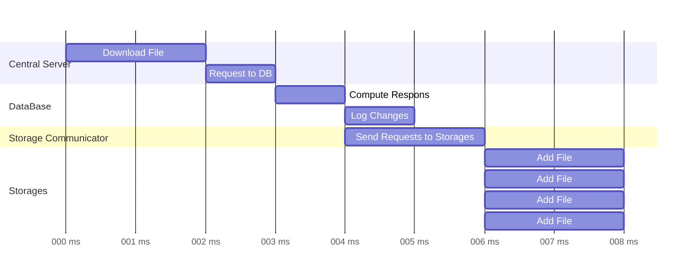
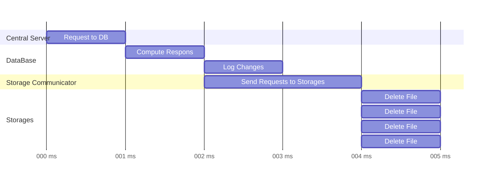
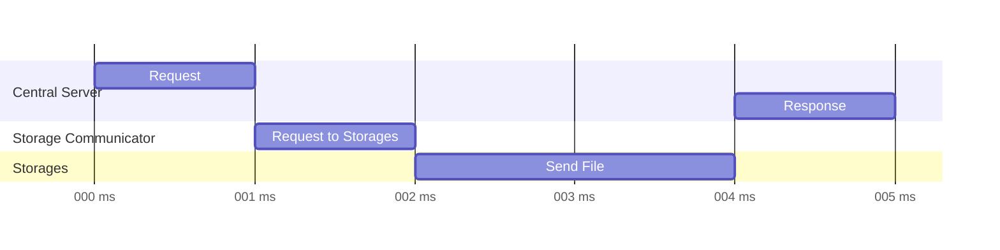
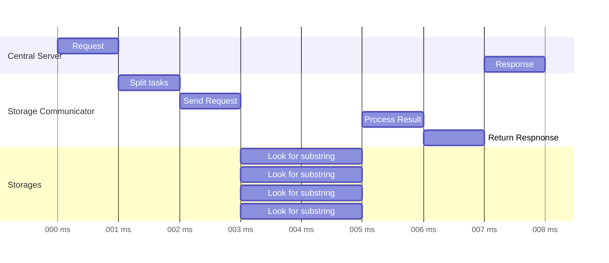
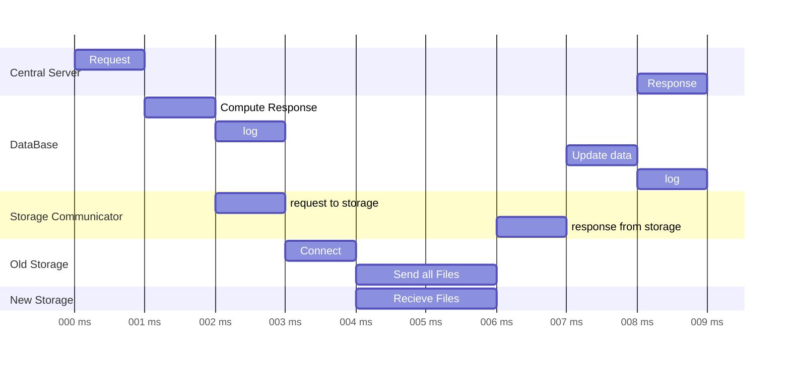

# Командный кейс No 5 «Разработка распределенного хранилища данных»
> Московская предпрофессиональная олимпиада Профиль «Информационные технологии»

## Cборка проекта
### Сборка сервера
````shell 
git clone https://github.com/Cyber-Zhaba/storage
cd storage/Storage
docker compose up -d
 ````
### Сборка сайта
````shell 
git clone https://github.com/Cyber-Zhaba/storage
cd storage/WebApp
docker compose up -d
 ````

## Оглавление
1. [Цель](#Цель)
2. [Задачи](#Задачи)
3. [Логика и структурные схемы](#Логика-и-структурные-схемы)
4. [Хранение](#Хранение)
5. [Основные алгоритмы](#Основные-алгоритмы)
    1. [Добавление файла](#добавление-файла)
    2. [Удаление файла](#удаление-файла)
    3. [Получить файд](#получить-файл)
    4. [Поиск подстроки](#поиск-подстроки)
    5. [Добавление сервера](#добавление-сервера)
6. [Тестирование](#тестирование)
7. [Значения кода лога](#значения-кода-лога)

## Цель:
- Разработать веб-приложения, представляющее собой распределенное хранилище данных для хранения текстовых файлов и выполнения полнотекстового поиска.
## Задачи:
- [X] Создание интерфейса администратора и пользователя
    - [X] Регистрация, вход
    - [X] Поиск
    - [X] Изменение данных файла
    - [X] Загрузка файлов
    - [X] Создание возможностей администратора
      - [X] Просмотр всех файлов
      - [X] Подключение и удаление, просмотр информации о серверах
      - [X] Возможность изменение данных любых файлов
      - [X] Просмотор действий пользователей
      - [X] Изменение данных пользователей
- [X] Реализация функции поиска данных
    - [X] Получить список серверов с актуальной версией файла
    - [X] Разбить файлы по строкам и ассинхроно отправить задачу на поиск серверам
    - [X] Собрать ответ
- [X] Разработка системы, состоящей из центрального сервера и серверов-хранилищ
    - [X] Сервер хранилища
       - [X] Обеспечение дублирования данных на серверах-хранилищах
    - [X] Центральный сервер
      - [X] Базы данных для: документов, пользователей, серверов
      - [X] Управление действиями серверов-хранилищ через центральный сервер.


# Логика и структурные схемы

Обработка запросов от пользователя производится на Центральном Сервере. Запросы не связанные с взаимодействие с файлами, переадресовываются на сторону базы данных через разработанную систему API. Запросы связанные с взаимодействием с файлами сначала обрабатываются на Центральном Сервере, после проверки данных запрос переадресовывается на сторону Коммуникатора с Хранилищами. Запросы от Коммуникатора асинхронно отправляются к Хранилищам посредствам TCP запроса. Результаты выполнения операций на стороне Хранилищ собираются на стороне Коммуникатора, после чего возвращаются Центральному Серверу. Далее результаты обрабатываются, если необходимо, то вносятся изменения в базу данных. В результате формируется ответ, который возвращается пользователю. 
## Хранение
### Хранение файлов

Файлы описывается размером и именем и поддерживает два протокола взаимодействия: чтение и запись. Каждый файл размещённый в хранилище получает уникальное имя, чтобы избежать коллизий с уже существующими файлами. Все файлы хранятся в подпапке root, размещенной в каталоге проекта. Хранилище посредством TCP запроса принимает команды для выполнений операций с файлами. Тип операции и её корректность определяются на стороне Центрального Сервера.
### Структура баз данных

## Основные алгоритмы
Здесь и далее мы будем рассматривать примеры с четырьмя хранилищами, однако в реальности количество хранилищ может быть любым и операции с хранилищами будут масштабироваться в соответствии с их количеством.
### Добавление файла

### Удаление файла

### Получить файл

### Поиск подстроки

### Добавление сервера

## Тестирование
 - [](ссылка на страничку YouTube)
## Значения кода лога
| Тип |               Описание                |
|----:|:-------------------------------------:|
|   0 |             Регистраиция              |
|   1 |         Успешная авторизация          |
|   2 |             Попытка входа             |
|   3 |                 Выход                 |
|   4 |     Изменение данных пользователя     |
|   5 |           Добавление файла            |
|   6 |            Изменение файла            |
|   7 |            Удаление файла             |
|   8 |          Добавление сервера           |
|   9 | Остановка/отключение/удаление сервера |
|  10 |           Включение сервера           |
